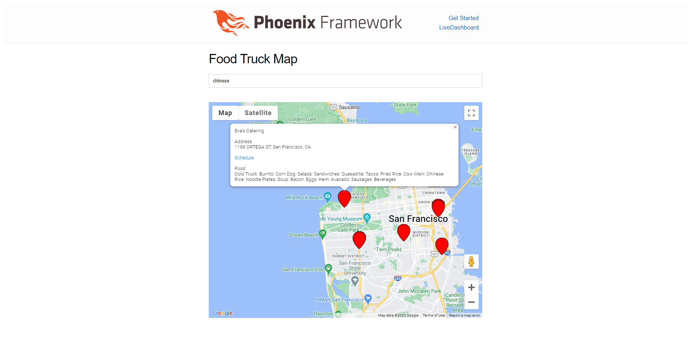

# Fuud

# Description
This is part of a programming assessment for Estee Lauder where they prompted for some application that may make it easier to view food trucks in the San Francisco area.

When booted up, a user can navigate to "localhost:4000" on their machine and see a Google Map displaying food trucks with approved permits in the San Fancisco area.

If someone were feeling "Chinese food" to eat, they could search "chinese" in the search bar and find all of the food trucks with chinese food.

One can click on the map markers and get more details about the food truck such as whose food truck it is, address, a link to the schedule, and what food items the food truck provides.

YUM YUM ENJOY!

To start your Phoenix server:

  * Install dependencies with `mix deps.get`
  * Create and migrate your database with `mix ecto.setup`
  * Start Phoenix endpoint with `mix phx.server` or inside IEx with `iex -S mix phx.server`

Now you can visit [`localhost:4000`](http://localhost:4000) from your browser.

Ready to run in production? Please [check our deployment guides](https://hexdocs.pm/phoenix/deployment.html).

## Learn more

  * Official website: https://www.phoenixframework.org/
  * Guides: https://hexdocs.pm/phoenix/overview.html
  * Docs: https://hexdocs.pm/phoenix
  * Forum: https://elixirforum.com/c/phoenix-forum
  * Source: https://github.com/phoenixframework/phoenix
